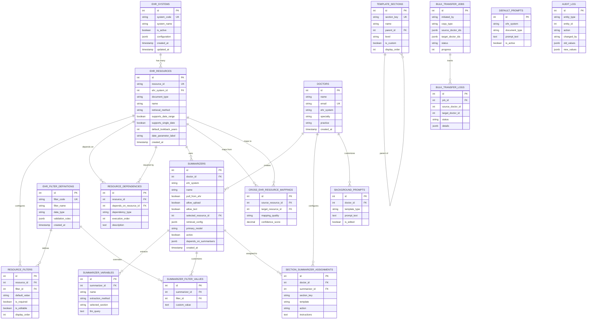

## Complete Entity Relationship Diagram

This document provides visual representation of the database schema relationships.

### Main Schema Overview



### Relationship Details

#### 1. EHR Configuration Layer

**Purpose**: Define what EHR resources exist and how they work

- `ehr_systems` → `ehr_resources` (1:M)
  - Each EHR system has multiple resources
  
- `ehr_resources` → `resource_filters` (1:M)
  - Each resource can have multiple filters
  
- `ehr_filter_definitions` → `resource_filters` (1:M)
  - Global filter catalog linked to resources
  
- `ehr_resources` → `resource_dependencies` (Self-referencing M:M)
  - Resources can depend on other resources

#### 2. Doctor & Summarizer Layer

**Purpose**: Store actual configurations created by ops

- `doctors` → `summarizers` (1:M)
  - Each doctor has multiple summarizers
  
- `ehr_resources` → `summarizers` (1:M)
  - Each resource is used by multiple summarizers
  
- `summarizers` → `summarizer_variables` (1:M)
  - Each summarizer can extract multiple variables
  
- `summarizers` → `summarizer_filter_values` (1:M)
  - Each summarizer can override filter defaults

#### 3. Template Layer

**Purpose**: Map summarizers to template sections

- `template_sections` → `template_sections` (Self-referencing 1:M)
  - Hierarchical parent-child structure
  
- `summarizers` → `section_summarizer_assignments` (1:M)
  - Link summarizers to specific sections

#### 4. Cross-System Features

**Purpose**: Support bulk operations and cross-EHR transfers

- `ehr_resources` → `cross_ehr_resource_mappings` (M:M)
  - Map equivalent resources across EHRs
  
- `bulk_transfer_jobs` → `bulk_transfer_logs` (1:M)
  - Track individual operations within jobs

### Data Flow Example

**Creating a Summarizer:**

```
1. Select Doctor (doctors table)
   ↓
2. Select EHR Resource (ehr_resources table)
   ↓
3. Load Available Filters (resource_filters table)
   ↓
4. Create Summarizer (summarizers table)
   ↓
5. Save Custom Filters (summarizer_filter_values table)
   ↓
6. Validate Dependencies (resource_dependencies table)
   ↓
7. Assign to Sections (section_summarizer_assignments table)
```

### Key Constraints

1. **Uniqueness**:
   - `doctors.email` - One doctor per email
   - `ehr_systems.system_code` - One record per EHR
   - `(summarizer_id, filter_id)` - One custom value per filter per summarizer

2. **Referential Integrity**:
   - CASCADE deletes: When doctor deleted, summarizers deleted
   - RESTRICT deletes: Cannot delete EHR resource if in use

3. **Check Constraints**:
   - Summarizer must have at least one input method
   - Resource dependency cannot be self-referencing
   - Retrieval method must match configured supports flags

### Index Strategy

**Performance-Critical Indices:**

1. Foreign keys (all)
2. Composite indices on commonly queried pairs
3. JSON indices on JSONB columns (PostgreSQL)
4. Partial indices on active records

**Example Query Optimizations:**

```sql
-- Fast: Uses idx_summarizers_doctor_active
SELECT * FROM summarizers 
WHERE doctor_id = 1 AND active = true;

-- Fast: Uses idx_ehr_resources_ehr_system_active
SELECT * FROM ehr_resources 
WHERE ehr_system_id = 2 AND is_active = true;
```

